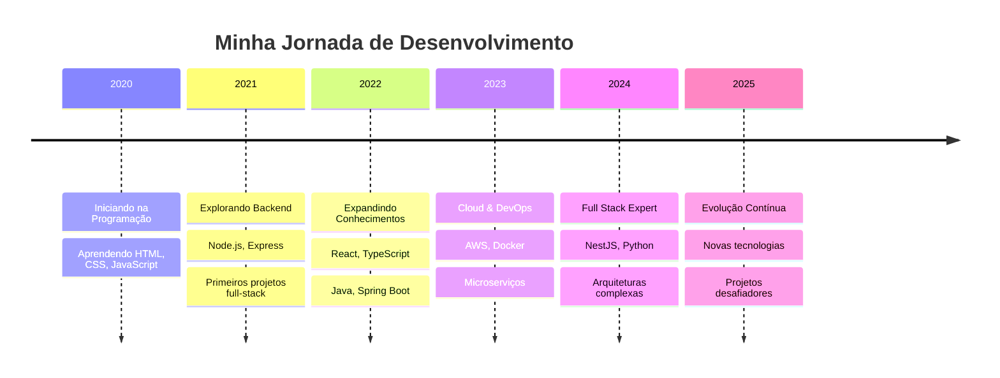

# 🚀 Elebeg - Full Stack Developer

<div align="center">
  
  
  
  

</div>

## 🎯 Sobre Mim

Sou um desenvolvedor Full Stack apaixonado por tecnologia e sempre em busca de novos desafios. Especializado em criar aplicações escaláveis e performáticas usando tecnologias modernas.

```javascript
const Elebeg = {
    code: ["TypeScript", "JavaScript", "Java", "Python"],
    askMeAbout: ["web dev", "backend", "cloud", "microservices"],
    technologies: {
        frontEnd: {
            js: ["React"],
            css: ["Tailwind", "Styled-Components"]
        },
        backEnd: {
            js: ["Node.js", "Express", "NestJS"],
            java: ["Spring Boot"],
            python: ["FastAPI", "Django"]
        },
        cloud: ["AWS"],
        devOps: ["Docker", "Git"],
        databases: ["MongoDB", "PostgreSQL", "Redis"],
        misc: ["Socket.io", "GraphQL", "REST APIs"]
    },
    currentFocus: "Construindo aplicações escaláveis e performáticas",
    funFact: "Eu debugo com console.log() e não tenho vergonha disso! 😄"
};
```

## 🛠️ Tech Stack

<div align="center">

### Linguagens


### Frameworks & Libraries


### DevOps & Tools


### Databases


</div>

## 📊 GitHub Analytics

<div align="center">
  
  
</div>

<div align="center">
  
</div>

## 🏆 GitHub Trophies
<div align="center">
  
</div>

## 📈 Contribution Graph
<div align="center">
  
</div>

## 🌟 Projetos em Destaque

Aqui estão alguns dos meus projetos que mais me orgulho:

<div align="center">
  
  [](https://github.com/Elebeg/ReservasAABB)
  [](https://github.com/Elebeg/douumhelpfrontweb)

</div>

> **Nota:** Certifique-se de substituir `awesome-project` e `cool-api` pelos nomes reais dos seus repositórios.

## 🎮 Quando não estou codando...

</div>
<table align="center">
<tr>
<td align="center">🎵</td>
<td><strong>Música</strong><br/>Ouvindo diversos gêneros musicais</td>
<td align="center">📚</td>
<td><strong>Aprendizado</strong><br/>Sempre estudando novas tecnologias</td>
</tr>
<tr>
<td align="center">🎮</td>
<td><strong>Gaming</strong><br/>Relaxando com videogames</td>
<td align="center">☕</td>
<td><strong>Café</strong><br/>Combustível do desenvolvedor</td>
</tr>
<tr>
<td align="center">🌱</td>
<td><strong>Open Source</strong><br/>Contribuindo para a comunidade</td>
<td align="center">💡</td>
<td><strong>Inovação</strong><br/>Criando soluções criativas</td>
</tr>
</table>

## 🤝 Vamos nos conectar!

<div align="center">
  
  [](https://linkedin.com/in/lucas-schuler-foppa-24723b272/)
  [](mailto:lucasfoppa@hotmail.com)
  [](https://github.com/Elebeg)

</div>

## 💼 Experiência Profissional



## 🎯 Objetivos para 2025

- [ ] 🚀 Contribuir para mais projetos open source
- [ ] 📱 Aprender desenvolvimento mobile (React Native)
- [ ] ☁️ Certificação AWS
- [ ] 🧠 Estudar Machine Learning
- [ ] 📝 Escrever mais artigos técnicos
- [ ] 🎤 Palestrar em eventos de tecnologia

## 💭 Filosofia de Desenvolvimento

> "Clean code always looks like it was written by someone who cares." - Robert C. Martin

Acredito que código limpo, bem documentado e testado é a base para aplicações robustas e escaláveis. Sempre busco aplicar as melhores práticas de desenvolvimento e manter-me atualizado com as tendências do mercado.

## 📈 Estatísticas Detalhadas

<div align="center">
  
</div>

<div align="center">
  
</div>

---

<div align="center">
  
  ### 🌊 "Code is like humor. When you have to explain it, it's bad." - Cory House
  
  **Obrigado por visitar meu perfil! Sempre aberto para colaborações e novos desafios.** 🚀
  
  

</div>